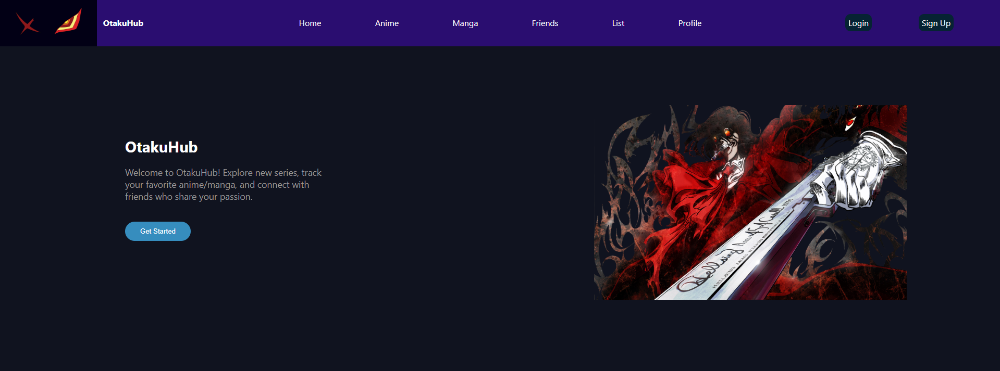

# OtakuHub

## What is OtakuHub ?

Otakuhub is a social platform designed for anime and manga lovers. It offers a suite of features, including allowing users to explore, track, and rate their favorite anime and manga. The platform provides personalized recommendations based on users' saved lists, enabling them to discover new content tailored to their preferences. Additionally, users can connect with like-minded otakus, add friends, and engage in discussions through the built-in chat feature. The platform is developed using the MERN stack (MongoDB, Express.js, React, Node.js) and utilizes AWS Cognito and Amplify for site deployment and user authentication. (In Progress, features to be implemented.)

 

## Live Site
- https://testdeploy.d32b9itw4dzrl3.amplifyapp.com/

## Installation

- To run this project locally, follow these steps:

1. Clone this repository.
2. Open the project and navigate to the "/FrontEnd" and "/backend" directories in your terminal or PowerShell.
3. Add .env files in /FrontEnd and /backend, and follow the instruction in the .env.example file.
4. Run "npm install" in both directories to install all dependencies.
5. To start the frontend and backend servers, run npm run dev in the "/FrontEnd" and "/backend" directories respectively.

### \*Note: This app can still be executed even if the database string is not present in the .env file within the /backend directory; however, only the frontend will be operational.

## Usage

### Once the project is set up and running, users can:

- Look up anime and manga.
- Add anime and manga to their list.
- Rate and review anime and manga.
- Find and add friends.
- View and rate friends' lists.
